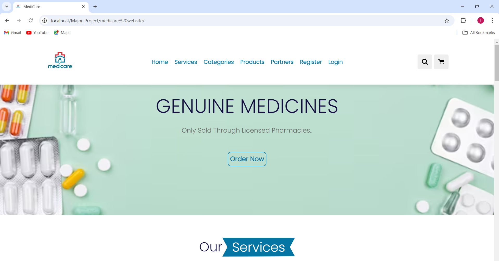

# Medicare

In the ever-evolving landscape of healthcare, our venture aims to revolutionize the way our individual’s access and procure medical supplies through the establishment of an innovative E-Pharmacy website. Recognizing the limitations of the existing traditional system, we are driven to create a more efficient and accessible platform that caters to the diverse needs of our users.

# Features of my website

# Customer Section --
1.	Search bar: When a customer clicks on the search icon, the search bar will be         popped up.
2.	Login/Sign-Up: If user is already our customer, then he/she can directly login to our website by giving email and password. If not he/she will click on Register button. By giving his details, he/she will become registered user.
3.	Cart: For adding the products in the cart, the mandatory condition is that the user should be logged in, otherwise he/she will be redirected to Login page.
4.	Order: After adding products to the cart customer can place order.
5.	Invoice: After providing order details, he will get invoice

# Admin Section --
1.	Login/Sign-Up: If user having role id as 1, then he/she can directly login to admin panel by giving email and password. 
2.	Stock Management: By clicking on the Edit button, admin can update the medicine price and by clicking on the receive medicines button he can receive the medicines from suppliers. By clicking on the Delete button, the medicine will be deleted from the database.
3.	Addition of Medicines: By clicking on the add medicine button, the new medicines will be added to the database.
4.	Add Categories: By clicking on the add item button, the new categories will be added to the database. By clicking on the update quantity button, he can update the quantity of products in the particular category.
5.	Suppliers: Admin can add the suppliers of the medicine.
6.	Expenses: In this section admin have the details about the damaged medicine and expired medicines.

# Technology stack used in this project

1. Frontend - HTML5 , CSS3 , Javascript
2. Frameworks - Bootstrap
3. Backend - PHP
4. Database - MYSQL

# Here is the preview of my website

